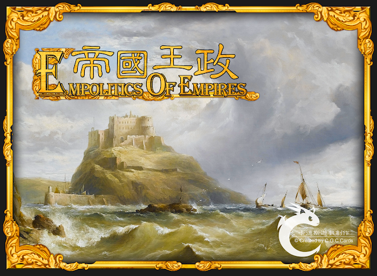

## 简介
> 这是一款手牌管理类型的微策略历史卡牌游戏。
游戏中，玩家将扮演一位国王、皇帝或是领导者，
在群雄并起的王国里争夺最后的王位，
只有手握「 政权 」、信仰「 宗教 」、建立「 王国 」最多者，
才有资格成为一位伟大的「 王 」！

* 游戏人数：2 ~ 4 人
* 适合年龄：13 +
* 游戏时间：30 ~ 45分
* 游戏分类：策略游戏 / 历史模拟游戏 / 中度策略
* 卡式游戏难度：★★★★★★☆☆☆☆ (等级六 - 中等偏难)

> 统一六国的秦始皇、帝国的创立者君士坦丁.....
古今中外、历史上曾经功绩显着的王，
都将齐聚一堂。

> 最丰富的历史故事、最多样化的技能搭配，
快来缔造一个前所未有的强大帝国！

因为是谷歌博客 境内无法直接访问😂
- [作者博客游戏介绍](https://cardsgamecreation.blogspot.com/p/blog-page.html)
- [作者博客开箱文](https://cardsgamecreation.blogspot.com/p/blog-page_30.html)

## 玩法
在游戏开始时，要先进行起始设置，才能开始进行游戏。

1. 选择帝王：发给每位玩家 3 张帝王牌，每位玩家从中选择 1 张帝王牌作为游戏中的角色。
 > 若加入扩充版，可以发 5 张帝王牌，再从中选 1 张帝王牌作为游戏中的角色。

2. 发放帝王技能卡及提示卡：发给每位玩家对应的帝王技能卡和提示卡
 提示卡仅作为帝王的操作技巧，玩家可以自由选择是否拿取。

3. 发放计分板：发给每位一张计分板，并将征税值与贸易值( 可参考回合流程 )各调整至 3 点。

4. 选择起始玩家：玩家可以用任意方式选择一名玩家作为「 起始玩家 」；若无法决定，这里提供一些选择方法：
 1. 依照选择帝王的「 在位年份 」，在位年份最早的玩家作为「 起始玩家 」
 2. 最熟悉这款游戏的玩家作为「 起始玩家 」
 3. 年龄最大的玩家作为「 起始玩家 」
 4. 最熟悉历史的玩家作为「 起始玩家 」
 5. 掷骰决定「 起始玩家 」

5. 洗牌与发牌：将中央的卡牌充分洗牌；发给「 起始玩家 」 4 张手牌、其他玩家 5 张手牌。

在发完牌后，即可开始进行游戏；之后的回合就依照回合流程进行，直到有任意一名玩家获得胜利。

更多卡牌介绍可以参考作者的维护的 [Wiki](https://eoe.fandom.com/zh/wiki/%E6%A8%99%E6%BA%96%E7%89%88)