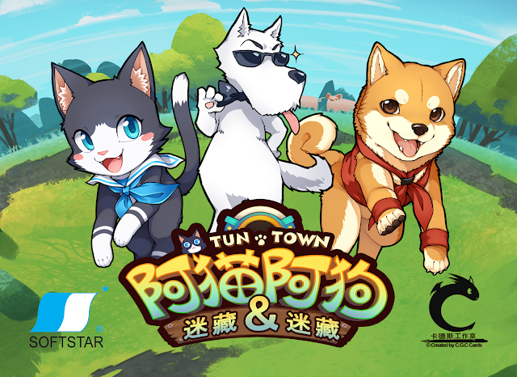

## 简介
> 与可爱的阿猫阿狗们一同追逐嬉戏！

* 游戏人数：2 ~ 6 人
* 适合年龄：8 +
* 游戏时间：10 ~ 15分
* 游戏分类：家庭游戏 / 派对游戏 / 手牌掌控 / 品牌合作
* 卡式游戏难度：★★★☆☆☆☆☆☆☆ (等级三 - 轻度简单 - 适合国小、国中以上的玩家)

[作者博客游戏介绍](https://cardsgamecreation.blogspot.com/p/54.html) 因为是谷歌博客 境内无法直接访问😂

## 玩法

玩家一開始會抽選阿貓阿狗角色牌組成小隊，
然後輪流當鬼，捕抓其他玩家的貓狗；
其他玩家當鬼時，則可以利用各種道具來加速、或降低鬼的速度。

遊戲結束時獲得最多加分的玩家獲勝！